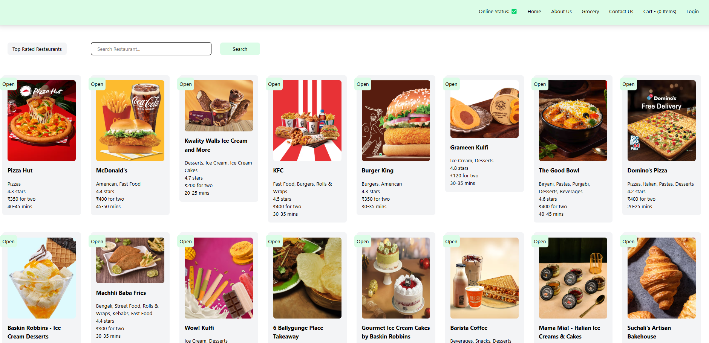

## ABOUT THE PROJECT

<h1> Yummy Bites </h1>
<div align="center"  width="100" height="100">
  
  <br>
  <br>
  <p>Welcome to Yummy Bites, your go-to destination for delicious, fast, and fresh food! Whether you're craving spicy snacks, hearty meals, or sweet desserts, we bring the best flavors right to your doorstep.</p>
</div>
<hr>

## TECH STACKS USED

<p align = "center">

</p>
<hr>

## Features

-

## Run Locally

### Clone this Project

```
https://github.com/Swati-Tanu/YummyBites
```

### Install npm Packages

```javascript
npm i --global
```

### Run Server

```javascript
npm run start
```

### Runs the project in the development mode

[http://localhost:1234](http://localhost:1234)

### Builds the project for production

```javascript
npm run build
```

<div align = "center">

| `Demo` |
| :----: |

[LIVE](https://yummybiteswebsite.netlify.app/)

| `Project Highlights` |
| :------------------: |

 <div align = "center">
   <h2>Landing Page</h2>



  <div/>
<br>
 
| `Authors` |
| :-------: | 
 
 [SWATI TANU](https://github.com/Swati-Tanu)

## Contributions

Contributions are always welcome! Please submit an issue using the issue tab above if you have feedback or improvement suggestions. I would appreciate it if you could submit a pull request with a fix.
